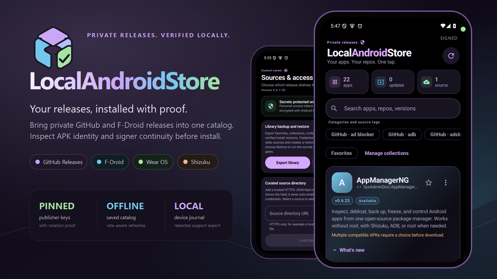
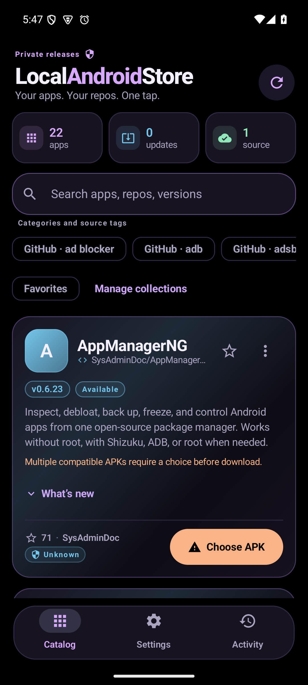
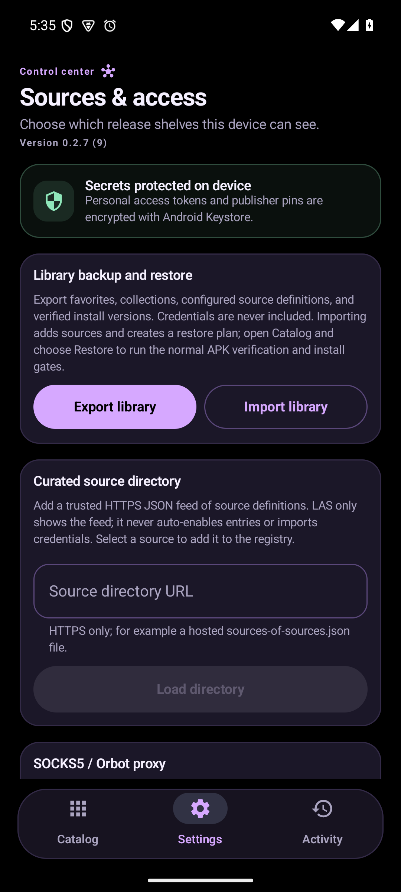
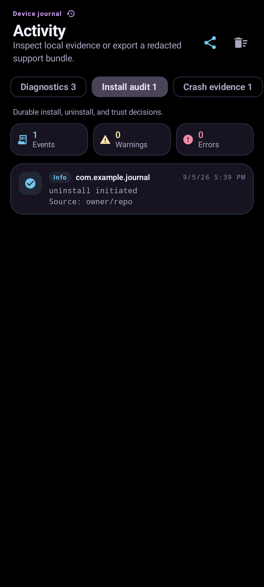
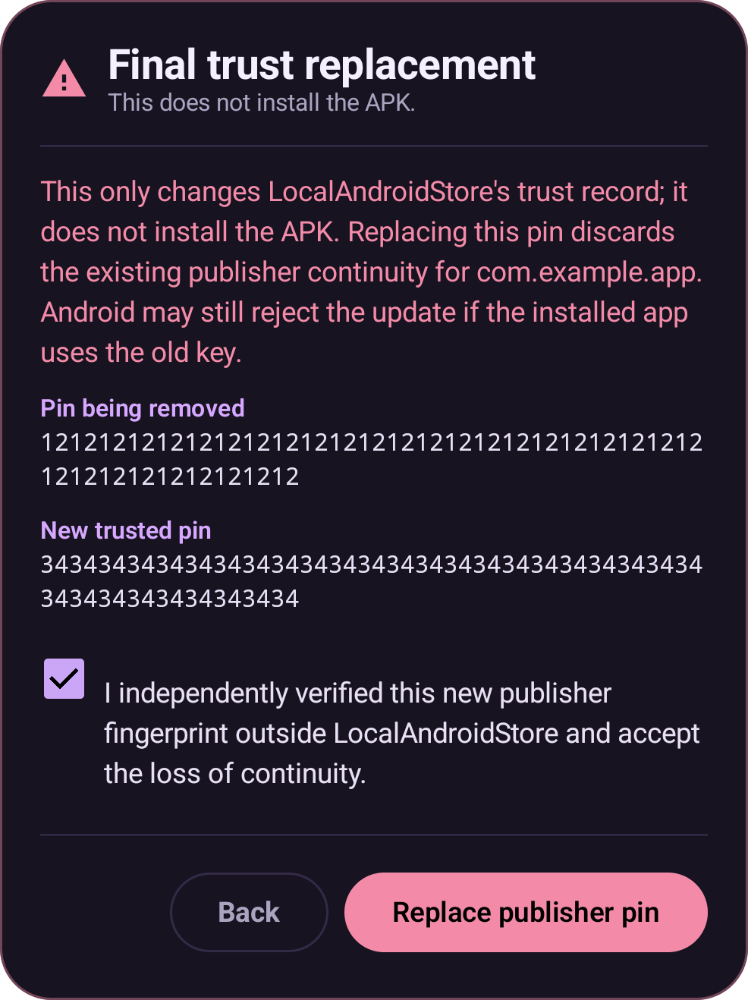

<p align="center">
  
</p>

<h1 align="center">LocalAndroidStore</h1>

<p align="center">
  <strong>Your releases, installed with proof.</strong><br />
  A private Android catalog for GitHub and F-Droid releases, with APK inspection and publisher continuity built in.
</p>

<p align="center">
  <a href="https://github.com/SysAdminDoc/LocalAndroidStore/releases/latest"></a>
  <a href="LICENSE"></a>
  <a href="https://developer.android.com/about/versions/oreo"></a>
  <a href="https://kotlinlang.org/"></a>
</p>

<p align="center">
  <a href="https://github.com/SysAdminDoc/LocalAndroidStore/releases/latest/download/LocalAndroidStore-v0.2.7-release.apk"><strong>Download the Android app</strong></a>
  &nbsp;·&nbsp;
  <a href="#trust-before-install">See the trust model</a>
  &nbsp;·&nbsp;
  <a href="#build-from-source">Build from source</a>
</p>



LocalAndroidStore is for people who publish Android apps outside a public store. Point it at GitHub owners or fingerprint-pinned F-Droid repositories. It finds installable releases, remembers what is on the device, and makes every install pass the same package and publisher checks.

The catalog is useful on a fresh phone, a test device, or a private fleet. It can follow public projects too. A personal access token is optional, source-specific, and stored only on the device.

## See it in action

<table>
  <tr>
    <td width="33%" align="center"><br /><sub>Authenticated catalog with 22 installable releases</sub></td>
    <td width="33%" align="center"><br /><sub>Source controls, encrypted secrets, backup, and restore</sub></td>
    <td width="33%" align="center"><br /><sub>Device journal with deterministic test evidence</sub></td>
  </tr>
</table>

The catalog and Settings images above come from the signed v0.2.7 release running on an Android 15 emulator. The journal image uses the app's deterministic visual-test data so its diagnostic categories stay reproducible.

## What makes it different

- **Several sources, one library.** Add GitHub users or organizations, private repositories through a read-only token, and F-Droid index-v2 endpoints with a required fingerprint.
- **APK evidence comes first.** LocalAndroidStore checks the exact download, manifest package, version, signing schemes, and current signer before permission review.
- **Publisher continuity survives updates.** The first accepted signer becomes a local pin. A valid APK Signature Scheme v3 or v3.1 rotation lineage can advance it. An unrelated key is blocked.
- **The catalog remains useful offline.** ETags reduce repeat work, refreshes have bounded concurrency, and a dated on-device snapshot can remain available for up to seven days.
- **Release management goes beyond a download button.** Browse history, follow a channel, compare standalone variants, install split archives, stage updates, and restore a saved library.
- **Android stays in charge of consent.** The normal path uses `PackageInstaller.Session` and Android's confirmation UI. Shizuku is an explicit option for users who already run it.
- **It fits more than a phone.** The UI supports touch, large screens, Android TV directional navigation, AMOLED and light themes, plus a separate Wear OS update-count companion.

## A safer private catalog

| Question | Browser and file manager | LocalAndroidStore |
| --- | --- | --- |
| What changed? | Check each release page | One searchable catalog with update state |
| Which file fits this device? | Infer it from the filename | Compare ABI, density, SDK, and package metadata |
| Is the APK signed as expected? | Usually unknown | Verify with `apksig` and compare publisher evidence |
| Did the publisher key change? | Easy to miss | Block unrelated signers and require a separate recovery review |
| Can I work during a GitHub outage? | Only with files already downloaded | Use a dated, clearly marked catalog snapshot |
| What happened on this device? | Reconstruct it manually | Read a local journal and export a redacted support bundle |

If you only track one public APK, a release page may be enough. LocalAndroidStore earns its place when the source list is private, the catalog is large, or signer continuity matters.

## Trust before install

Every install follows one shared decision path:

```text
Release asset
  -> bounded download and SHA-256
  -> package, version, and split inspection
  -> cryptographic APK signature verification
  -> publisher pin or verified rotation lineage
  -> permission and version review
  -> Android PackageInstaller or approved Shizuku session
```

An unrelated signer never becomes trusted because a repository served it. LocalAndroidStore shows the installed signer, saved pin, downloaded signer, verified schemes, and available rotation evidence. Recovery changes the trust record only. It does not resume the install.

<p align="center">
  
</p>

The app can verify properties of the bytes it downloaded and compare them with local history. It cannot prove that a GitHub account owner or signing key has not been compromised. The source threat model in Settings makes that boundary visible instead of hiding it.

## Install

### Phone, tablet, or Android TV

1. Download [LocalAndroidStore v0.2.7](https://github.com/SysAdminDoc/LocalAndroidStore/releases/latest/download/LocalAndroidStore-v0.2.7-release.apk).
2. Check the file against [SHA256SUMS](https://github.com/SysAdminDoc/LocalAndroidStore/releases/latest/download/SHA256SUMS) if you verify downloads manually.
3. Open the APK. Android may ask you to allow installs from the app you used to open it.
4. Launch LocalAndroidStore, open Settings, and save your first source.

Android 8.0 or newer is required. Android 12 or newer can use Material You colors, and Android 15 adds managed-app archiving.

### Wear OS companion

The separate [Wear OS APK](https://github.com/SysAdminDoc/LocalAndroidStore/releases/latest/download/LocalAndroidStore-v0.2.7-wear-release.apk) provides an update-count Tile and a short-text complication. A paired watch can ask the phone to refresh. APK installation stays on the phone.

### Optional Shizuku path

The default installer works without root or Shizuku. If Shizuku is already running, Settings can opt into its shell-owned install session. Digest, package, signer, version, and audit checks still run before a session is created. When Shizuku is unavailable, LocalAndroidStore falls back to Android's normal installer.

## First setup

1. Open **Settings** from the bottom navigation.
2. Edit the default GitHub source or add another owner or organization.
3. Add a source-specific personal access token if you need private repositories or a larger rate budget. For a fine-grained token, grant repository metadata and contents read access only.
4. Save the source registry, return to **Catalog**, and refresh.
5. Open a card to choose an APK, inspect an older release, or set a preferred channel.

Tokens are masked in the UI. Removing or renaming a source also removes its credential override when the registry is saved.

## Release formats

| Source or asset | Support |
| --- | --- |
| GitHub `.apk` release assets | Discover, inspect, download, and install |
| `.apks`, `.xapk`, `.apkm`, `.apkset` | Bounded private extraction with per-split package and signer checks |
| F-Droid index-v2 | Fingerprint-pinned repository metadata, signed entry verification when provided, APK digest checks |
| Multiple standalone APKs | Device-aware matrix for ABI, density, minimum SDK, size, and digest |
| Android App Bundle `.aab` | Not converted on-device. Publish an APK or prebuilt APK set beside it |

Historical releases use the same foreground checks as the latest release. Downgrades and reinstalls remain explicit. Selected historical builds never enter the background update queue by themselves.

## Everyday controls

- Search by app name, repository, version, package id, tag, or description.
- Mark favorites and build collections that survive library export and restore.
- Follow stable, beta, alpha, release-candidate, nightly, or development channels per repository.
- Choose a preferred source when several repositories publish the same Android package.
- Stage managed updates, apply per-app cadence rules, and keep dated holds.
- Inspect an installed APK's decoded manifest, signing block, digests, and static tracker-signature matches without uploading it.
- Archive managed apps on Android 15 or newer while keeping their data and restore path.

## Privacy and local data

| Data | Handling |
| --- | --- |
| GitHub personal access tokens | Tink AEAD-encrypted app-private file with an Android Keystore-protected keyset |
| Publisher pins and install evidence | Stored on-device and used by the shared verification path |
| Catalog snapshots and partial downloads | App-private storage with explicit age and size bounds |
| Library exports | Favorites, collections, source definitions, and verified install records; credentials are excluded |
| Support bundles | Allowlisted, bounded, and redacted before Android's share sheet opens |

There is no advertising SDK or analytics service. Network requests go to the release sources and optional branding or source-directory URLs you configure. An optional SOCKS5 endpoint can route those requests with proxy-side DNS.

## Build from source

The project uses Gradle 9.3.1, Android Gradle Plugin 9.1.1, Kotlin 2.4.10, and Compose BOM 2026.06.01. Compile and Kotlin targets are Java 17.

Prerequisites:

- Android Studio or the Android SDK with API 37
- JDK 17 or newer
- An Android 8.0 or newer emulator or device for runtime checks

```bash
git clone https://github.com/SysAdminDoc/LocalAndroidStore.git
cd LocalAndroidStore
./gradlew :app:testDebugUnitTest :app:lintDebug :app:assembleDebug
./gradlew :app:assembleDebugAndroidTest :app:assembleRelease
./gradlew :wear:testDebugUnitTest :wear:assembleRelease
```

Windows users can run the same tasks through `gradlew.bat`.

Release signing is local by design. Without the repository owner's `keystore.properties` and keystore, Gradle can still compile the project but cannot produce the official signed release identity. Never commit a keystore or its passwords.

## Project map

| Path | Purpose |
| --- | --- |
| `app/src/main/kotlin/com/sysadmin/lasstore/data` | Source clients, encrypted settings, caches, journals, and export formats |
| `app/src/main/kotlin/com/sysadmin/lasstore/domain` | Discovery, release selection, channels, and catalog policy |
| `app/src/main/kotlin/com/sysadmin/lasstore/install` | Artifact verification, install sessions, recovery, and queued work |
| `app/src/main/kotlin/com/sysadmin/lasstore/ui` | Compose catalog, Settings, activity journal, and trust review |
| `wear` | Wear OS Tile, complication, and phone refresh request |
| `scripts` | Local version and trust-matrix verification |

The phone app is a single-activity Compose application. Long-running work uses coroutines, WorkManager, or Android's user-initiated job path. Runtime failures remain visible in the UI and device journal.

## Related project

[LocalChromeStore](https://github.com/SysAdminDoc/LocalChromeStore) applies the same personal-catalog idea to locally managed browser extensions.

## Contributing

Bug reports are most useful when they include the Android version, source type, release asset names, and the exact on-screen failure. Export a redacted support bundle from **Activity** when the problem reaches that screen. Do not post access tokens, APK signing keys, or an unredacted private repository URL.

See [CHANGELOG.md](CHANGELOG.md) for release history.

## License

[MIT](LICENSE)
